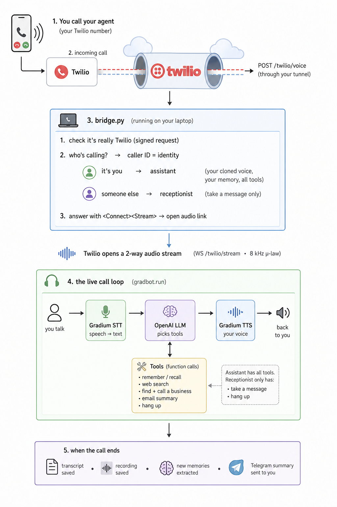

# Gradphone: A voice agent that acts as your clone.

Clone your own voice once, then get your clone to do things for you. 
From Telegram you can text it, send it voice notes (it replies in *your* voice), translate, and it remembers you across conversations. Over the phone your clone can **call you** (`/callme`) and **answer your number** — you reach your own assistant, while anyone else
reaches an AI receptionist that takes a message. On calls it can also **search the
web** and **summarize your email**.

---

## Building blocks

One small Python service runs two processes against a shared SQLite database:

| Piece | Role |
|---|---|
| **gradbot** | The voice pipeline: speech-to-text → LLM → text-to-speech. The clone's "voice + brain." |
| **Gradium** | Voice cloning, STT, and TTS — what makes the clone sound like you. |
| **LLM** | Any OpenAI-compatible endpoint (OpenAI, Groq, a local model, …) — generates replies. |
| **Twilio** | Phone calls in and out. A voice webhook points at your app. |
| **Telegram bot** | Your chat interface — onboarding, text/voice chat, and commands. |
| **bridge** | FastAPI service handling Twilio calls + the internal API (port 8082). |

**On Telegram:** `bot → Gradium STT → LLM → Gradium TTS → reply`, with facts
saved to a local database.

**On a phone call**, the same caller-ID branch decides everything — you reach your
assistant (your voice, memory, all tools); a stranger reaches a receptionist that
can only take a message:



Optional add-ons: Web search API, **Gmail** (email summary), **Google
Places** (look up a business to call). See [ARCHITECTURE.md](ARCHITECTURE.md) for
the deeper design.

---

## What your clone can do

| Capability | How you use it |
|---|---|
| Clone your voice | Send a 15–30s voice note on Telegram |
| Text chat | Type to the bot — it replies in text |
| Voice-note chat | Send a voice note — it replies in *your* voice |
| Translate | `/translate`, pick a language, send a voice note — hear it back in your voice |
| Remembers you | Tell it facts ("I'm vegetarian"); it recalls them later |
| Calls you (`/callme`) | It phones you and talks in your voice |
| Answers your number | You → your assistant; a stranger → AI receptionist |
| Web search / email (on calls) | "Search the web for…", "summarize my emails" — needs optional keys |

---

## Prerequisites

- **macOS or Linux** (Windows: use WSL2). **git** installed.
- A **phone that can receive an SMS** (once, to verify Twilio).
- LLM Key
- Telegram account

Python 3.12, ffmpeg, and cloudflared are installed for you by `scripts/setup.sh`.

---

## Setup

### 1. Fork, clone, and run setup

Fork [gradium-ai/digigrad](https://github.com/gradium-ai/digigrad) to your
account, then:

```bash
git clone https://github.com/<your-github-username>/digigrad && cd digigrad
scripts/setup.sh
```

This creates `.venv`, installs the app, and scaffolds `.env` with a
`BRIDGE_API_KEY` already generated and local-dev defaults set. Now you just
create the keys below and paste them in.

### 2. Create your keys

You'll sign up for four services. Here's each key and how to get it.

**Gradium** — voice cloning, STT, TTS · *required*

📹 **[Watch: getting your Gradium API key](docs/videos/gradium-api-key.mp4)**

1. Sign in at **gradium.ai** and open the dashboard.
2. Create an **API key** (`gsk_…`) → `GRADIUM_API_KEY`.
3. Pick any **voice UID** in your account (a built-in is fine) → `AGENT_VOICE_ID`.
   This is the default voice before *your* clone exists; the app won't start
   without it. Your personal clone is created later in Telegram and overrides it.

**LLM provider** — the "brain" · *required*

Any OpenAI-compatible endpoint; OpenAI is simplest. Create a key at
**platform.openai.com**, add a small balance, then set **all three**:

```
LLM_BASE_URL=https://api.openai.com/v1
LLM_MODEL=gpt-4o-mini
OPENAI_API_KEY=sk-...
```

Another host (Groq, Together, local LM Studio, …)? Point `LLM_BASE_URL` at its
`/v1` endpoint, set `LLM_MODEL`, and put its key in `OPENAI_API_KEY`.

**Telegram** — your clone's chat interface · *required*

1. Message **@BotFather**, send `/newbot`, pick a name and a username ending in
   `bot`. Copy the token (`8943…:AAH…`) → `TELEGRAM_BOT_TOKEN`.
2. Message **@userinfobot** to get your numeric **Id** → `ALLOWED_TELEGRAM_IDS`.
   The bot fails closed — without this it ignores everyone, including you.

**Twilio** — phone calls · *required for calls*

📹 **[Watch: getting your Twilio number](docs/videos/twilio-number.mp4)**

A free trial is enough for `/callme` to your own phone.

1. Sign up at **twilio.com** and verify your account (SMS code).
2. **Verify your own phone number** as a Caller ID — on the trial this is the only
   number your clone may call.
3. From the **Console dashboard** copy: **Account SID** (`AC…`) →
   `TWILIO_ACCOUNT_SID`, **Auth Token** → `TWILIO_AUTH_TOKEN`.
4. Get your **trial phone number** (Console → Phone Numbers) → `TWILIO_PHONE_NUMBER`.

> **Trial limits:** calls play a short "press any key" preamble and can only dial
> numbers you've verified — fine for `/callme`. To call any number with no
> preamble, **upgrade to paid** (add a card). Nothing else changes.

**Optional add-ons** (leave blank to skip): `LINKUP_API_KEY` (web search, from
app.linkup.so), `GMAIL_ADDRESS` + `GMAIL_APP_PASSWORD` (email summary, a 16-char
app password from myaccount.google.com/apppasswords), `GOOGLE_PLACES_API_KEY`
(look up a business to call).

### 3. Paste the keys into `.env`

Open `.env` and fill in what you created. Everything else (`BRIDGE_API_KEY`,
`TWILIO_MACHINE_DETECTION=Disable`, `ENABLE_INBOUND=true`,
`ALLOW_ARBITRARY_OUTBOUND=true`) is already set by `setup.sh` — don't touch it.

```bash
GRADIUM_API_KEY=gsk_...
AGENT_VOICE_ID=...

LLM_BASE_URL=https://api.openai.com/v1
LLM_MODEL=gpt-4o-mini
OPENAI_API_KEY=sk-...

TELEGRAM_BOT_TOKEN=...
ALLOWED_TELEGRAM_IDS=<your-telegram-id>

TWILIO_ACCOUNT_SID=AC...
TWILIO_AUTH_TOKEN=...
TWILIO_PHONE_NUMBER=+1XXXXXXXXXX
```

The full annotated list is in [`.env.example`](.env.example).

### 4. Run it

```bash
scripts/run_local.sh
```

This opens a public tunnel, writes its URL into `.env`, points your Twilio
number's voice webhook at it, and starts both processes. **Leave it running**;
Ctrl-C stops everything. Re-run any time — it re-syncs the tunnel + webhook (quick
tunnels rotate their URL on restart).

Check it's alive in another terminal:

```bash
curl http://localhost:8082/healthz
# {"status":"ok","gradbot_installed":true,...}
```

> **Deploying instead of running locally?** Render gives you a stable public URL
> with no local install via the included `render.yaml` — see
> [RENDER.md](RENDER.md) and [DEPLOYMENT.md](DEPLOYMENT.md).

---

## First use, in Telegram

1. Open your bot, send `/start`, then `/register`.
2. Tap **Share my number** so your clone recognizes you on calls.
3. Send a clean **15–30s voice note** → tap **✅ Yes, clone my voice**.
4. Try it:
   - **Text** anything → it replies as your clone.
   - **Send a voice note** → it replies in *your* voice.
   - **"translate this to Spanish"** then a voice note → translated, in your voice.
   - **`/callme`** → your clone phones you. Try interrupting it mid-sentence, or
     "what do you remember about me?".

### Commands

| Command | What it does |
|---|---|
| `/register [code]` | Become a tenant (clone owner). |
| `/callme <+number>` | Your clone calls that number and converses. |
| `/translate` | Pick a language, send a voice note, get it back in your voice. |
| `/voice` · `/clear_voice` | Show / delete your cloned voice. |
| `/history` · `/status` | Recent calls / calls in progress. |
| `/whoami` | Your Telegram ID + registration status. |

---

## Troubleshooting

| Symptom | Fix |
|---|---|
| `curl /healthz` fails | `run_local.sh` must still be running; check `/tmp/gradphone_bridge.log`. |
| Bot says nothing / `409 Conflict` | Two bots share one token — run only **one** `run_local.sh`; kill stray `gradphone.bot` processes. |
| "Missing required environment variable …" | That key is blank in `.env` — fill it and re-run. |
| `LLM_BASE_URL / LLM_MODEL not set` | You set only `OPENAI_API_KEY` — set all three (Setup §2). |
| Voice notes fail | ffmpeg isn't installed — re-run `scripts/setup.sh`. |
| Call connects then drops in seconds | Twilio AMD misread "hello" as voicemail — keep `TWILIO_MACHINE_DETECTION=Disable`. |
| You call in but get the receptionist | Your caller ID isn't linked — share your contact (First use §2). |
| "press any key" on a call | The Twilio trial preamble — upgrade to paid to remove it. |

---

## Voice agent concepts

Gradbot handles most of this for you, but these are the terms worth knowing.

<details>
<summary>Glossary</summary>

- **Cascaded pipeline** — speech-to-text → model → text-to-speech, chained. Every
  stage is inspectable and swappable. This is what gradphone uses.
- **Speech-to-speech (end-to-end)** — one model takes audio in, gives audio out. The other   main approach.
- **Half duplex** — one side talks at a time (walkie-talkie). Phone lines are half
  duplex by nature.
- **Full duplex** — both sides can talk at once, like a real conversation. The feel
  we want, even over a half-duplex line.
- **VAD (voice activity detection)** — telling when someone is speaking vs silent.
- **Endpointing / turn detection** — deciding when the caller finished their turn.
  Too eager cuts them off; too slow feels laggy.
- **Barge-in** — letting the caller interrupt while the agent is talking; the agent
  stops and listens. This is what makes a half-duplex line feel full duplex.
- **Fillers** — a short "let me see" so the line isn't dead while the model thinks.
- **Time to first audio** — how long from the end of your turn to the first sound
  back. This is what people feel as fast or slow, so on a live call we stream
  everything; off the call (voice notes, translation) we optimize for quality.
- **Wire format** — phone audio is 8 kHz μ-law (G.711). Mismatched sample rates are
  usually why audio sounds too fast or too slow.

</details>

---

## Cleanup

When you're done: stop the processes (Ctrl-C in the `run_local.sh` terminal),
delete your clone and recordings (`/clear_voice` in Telegram), and rotate any keys
that were handed to you.

